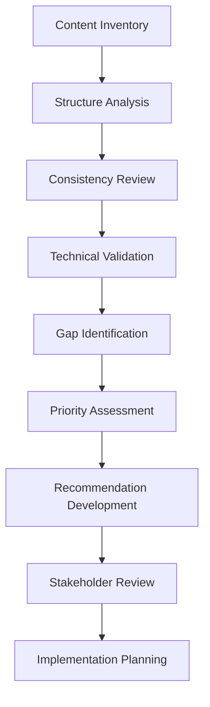

# Instruction File Analysis - Project Details

## Project Context

**Project Name**: Instruction File Analysis  
**Project Type**: Documentation Quality Assurance  
**Domain**: Technical Writing and Developer Experience  
**Timeline**: August - October 2025  

## Background and Motivation

The RVNK Plugin Ecosystem relies heavily on the `.github/copilot-instructions.md` file to guide GitHub Copilot in providing consistent, accurate, and helpful assistance to developers. As the ecosystem has evolved, particularly with the ongoing RVNKCore architectural refactor, the instruction file has grown organically, leading to:

### Current Challenges

1. **Consistency Issues**: Conflicting guidance across different sections
2. **Content Duplication**: Repeated information in multiple locations
3. **Organization Problems**: Suboptimal information architecture
4. **Technical Debt**: Outdated examples and references
5. **Coverage Gaps**: Missing documentation for newer patterns

### Strategic Importance

- **Developer Productivity**: Clear instructions reduce development friction
- **Code Quality**: Consistent patterns improve ecosystem reliability
- **Onboarding Experience**: Well-structured guidance accelerates contributor ramp-up
- **Maintenance Efficiency**: Organized documentation simplifies updates

## Project Objectives

### Primary Goals

1. **Achieve Content Consistency**
   - Eliminate contradictory guidance
   - Standardize terminology and patterns
   - Unify formatting and structure

2. **Optimize Information Architecture**
   - Improve logical flow and organization
   - Enhance discoverability and navigation
   - Strengthen cross-reference systems

3. **Ensure Technical Accuracy**
   - Validate all code examples and patterns
   - Update outdated references and APIs
   - Align with current ecosystem architecture

4. **Enhance Usability**
   - Improve clarity and actionability
   - Provide comprehensive coverage
   - Support diverse developer needs

### Secondary Goals

1. **Establish Quality Framework**
   - Create ongoing validation processes
   - Implement continuous improvement mechanisms
   - Build stakeholder feedback systems

2. **Support Ecosystem Evolution**
   - Align with RVNKCore architectural changes
   - Prepare for future technology adoptions
   - Enable scalable documentation maintenance

## Stakeholders and Requirements

### Primary Stakeholders

**RVNK Ecosystem Developers**
- **Needs**: Clear, accurate, actionable guidance
- **Pain Points**: Contradictory instructions, outdated examples
- **Success Criteria**: Reduced development friction, improved code consistency

**Plugin Maintainers**
- **Needs**: Comprehensive pattern coverage, integration guidance
- **Pain Points**: Missing documentation for complex scenarios
- **Success Criteria**: Complete workflow coverage, effective onboarding support

**Project Architects**
- **Needs**: Alignment with architectural decisions, forward compatibility
- **Pain Points**: Documentation lag behind architectural changes
- **Success Criteria**: Synchronized instruction updates, architectural alignment

### Secondary Stakeholders

**GitHub Copilot Users**
- **Needs**: Context-aware assistance, relevant suggestions
- **Pain Points**: Inconsistent AI guidance based on conflicting instructions
- **Success Criteria**: Improved AI assistance quality, consistent recommendations

**Community Contributors**
- **Needs**: Accessible contribution guidelines, clear standards
- **Pain Points**: Complex or unclear contribution requirements
- **Success Criteria**: Streamlined contribution process, clear quality standards

## Workflow and Process

### Analysis Workflow

### Quality Assurance Process

1. **Multi-Pass Review**
   - Content structure and organization
   - Technical accuracy and currency
   - Consistency and terminology
   - Usability and clarity

2. **Validation Methods**
   - Code example compilation and testing
   - Reference link verification
   - Integration scenario testing
   - Developer workflow validation

3. **Stakeholder Feedback**
   - Developer experience testing
   - Maintainer review sessions
   - Community feedback collection
   - Architecture alignment validation

### Implementation Approach

**Incremental Updates**
- Prioritize high-impact improvements
- Maintain backward compatibility
- Test changes with real scenarios
- Gather continuous feedback

**Change Management**
- Document all modifications
- Communicate changes to stakeholders
- Provide migration guidance where needed
- Track improvement metrics

## Success Criteria and Metrics

### Quantitative Metrics

**Content Quality Indicators**
- Consistency score (contradictions eliminated)
- Coverage percentage (documented patterns vs. used patterns)
- Accuracy rate (verified examples and references)
- Navigation efficiency (clicks to find information)

**Developer Experience Metrics**
- Onboarding time reduction
- Support question frequency
- Code review comment patterns
- Development velocity improvements

**Maintenance Efficiency**
- Update time requirements
- Change propagation accuracy
- Documentation debt accumulation
- Stakeholder satisfaction scores

### Qualitative Assessments

**Content Quality**
- Clarity and readability improvements
- Actionability enhancements
- Comprehensive coverage achievement
- Logical organization establishment

**User Experience**
- Developer satisfaction feedback
- Usage pattern observations
- Pain point resolution validation
- Workflow improvement confirmation

**Ecosystem Health**
- Pattern consistency across plugins
- Integration reliability improvements
- Documentation maintenance ease
- Community contribution quality

## Risk Assessment

### High-Priority Risks

**Scope Creep**
- **Risk**: Analysis revealing more issues than anticipated
- **Impact**: Timeline extension, resource overcommitment
- **Mitigation**: Strict prioritization, phased approach

**Technical Complexity**
- **Risk**: Deep integration requirements with ecosystem changes
- **Impact**: Implementation complexity, testing requirements
- **Mitigation**: Early architecture alignment, incremental validation

**Stakeholder Alignment**
- **Risk**: Conflicting requirements from different stakeholder groups
- **Impact**: Design conflicts, implementation delays
- **Mitigation**: Regular stakeholder communication, clear priority frameworks

### Medium-Priority Risks

**Resource Constraints**
- **Risk**: Limited time allocation for comprehensive analysis
- **Impact**: Reduced quality or scope
- **Mitigation**: Focus on high-impact areas, leverage automation

**Technology Evolution**
- **Risk**: Rapid changes in underlying technologies
- **Impact**: Outdated recommendations, additional update requirements
- **Mitigation**: Future-proofing strategies, flexible architecture

## Dependencies and Constraints

### Internal Dependencies

**RVNKCore Development**
- Architecture decision timelines
- API stability milestones
- Migration pattern finalization

**Plugin Development Activities**
- Feature implementation patterns
- Integration requirements evolution
- Testing framework updates

### External Dependencies

**Technology Stack Evolution**
- Spigot/Paper API updates
- Maven ecosystem changes
- Java platform developments

**GitHub Copilot Platform**
- AI assistant capability updates
- Integration pattern changes
- Performance characteristic evolution

### Project Constraints

**Timeline Limitations**
- Coordination with RVNKCore milestones
- Resource availability windows
- Testing and validation timeframes

**Compatibility Requirements**
- Backward compatibility maintenance
- Multi-version support needs
- Integration scenario preservation

## Long-term Vision

### Immediate Impact (Q4 2025)
- Comprehensive, consistent instruction file
- Improved developer experience
- Reduced documentation maintenance overhead

### Medium-term Goals (Q1-Q2 2026)
- Automated quality assurance processes
- Integrated ecosystem documentation
- Community-driven improvement mechanisms

### Long-term Vision (2026+)
- Self-maintaining documentation systems
- AI-assisted content optimization
- Ecosystem-wide documentation standardization
